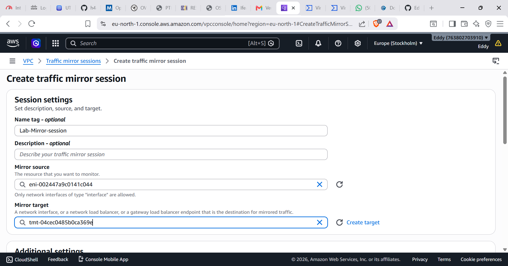

# SOC Lab Network Design

## Overview

This document explains the network architecture used for the SOC detection lab.

The lab simulates a real-world security monitoring environment using AWS infrastructure, endpoint monitoring, network detection, and attack simulation.

---

# Architecture Components

## 1. Wazuh Manager

Platform:
- AWS EC2 Linux Server

Role:
- Central SIEM/XDR platform
- Collects security logs
- Processes alerts
- Performs threat detection

Receives logs from:

- Windows Server Wazuh Agent
- Ubuntu Suricata Sensor

---

## 2. Windows Server Endpoint

Platform:
- AWS EC2 Windows Server

Security Tools:

- Wazuh Agent
- Microsoft Sysmon

Purpose:

Collect endpoint telemetry:

- Process creation
- Authentication events
- PowerShell activity
- Network connections
- File changes


Monitoring flow:
```
Windows Server
|
|
Wazuh Agent
|
|
Wazuh Manager
```
---

## 3. Ubuntu Suricata Sensor

Platform:
- AWS EC2 Ubuntu

Security Tool:

- Suricata IDS


Purpose:

- Network traffic inspection
- Intrusion detection
- Protocol monitoring


Configuration:

Interface monitored:
```
ens5
```
Log location:

```
/var/log/suricata/eve.json
```

Traffic flow:
```
Network Traffic
|
|
Suricata
|
|
eve.json
|
|
Wazuh
```

---

## 4. Kali Linux Attacker

Platform:

- Local Virtual Machine

Purpose:

Security testing and attack simulation.

Tools:

- Nmap
- Hydra
- Enumeration tools


Examples:

Network scanning:

```
nmap -sS <target-ip>
```
Brute force testing:
```
hydra -l username -P passwords.txt ssh://traget-ip
```

Kali Linux
     |
     |
Attack Simulation
     |
     |
Windows / Ubuntu
     |
     |
Wazuh Agent + Suricata
     |
     |
Wazuh Manager
     |
     |
Dashboard Investigation


## AWS Traffic Mirroring Implementation

## Overview

AWS Traffic Mirroring was configured to allow the Suricata sensor to inspect traffic from other EC2 instances.

The goal was to mirror network traffic from the monitored instances and forward copies of packets to the Suricata monitoring instance.

Traffic Mirroring architecture:
```
Monitored EC2 Instance
|
|
Traffic Mirror Source
|
|
Traffic Mirror Session
|
|
Traffic Mirror Target
|
|
Suricata Sensor (Ubuntu)
|
|
eve.json
|
|
Wazuh Monitoring
```

---

## Traffic Mirroring Components

### Source

The source interface was configured using the Network Interface (ENI) of the monitored EC2 instance.

Purpose:

- Capture mirrored packets
- Forward traffic copies to the sensor
- A traffic filter that allows all lab traffic, both in & out.

Screenshot:


### Target

A Traffic Mirror Target was created pointing to the Suricata monitoring instance.

Purpose:

- Receive mirrored packets
- Deliver traffic to Suricata for inspection

Screenshot:


### Mirror Session

A Traffic Mirror Session was created to connect the source and target.

Configuration included:

- Source ENI
- Target ENI
- Session number
- Filter rules

Screenshot:




## Verification

Traffic capture was tested on the Suricata sensor using:

```
sudo tcpdump -i ens5
```

Suricata interface:

```
interface: ens5
```

Suricata log location:

```
/var/log/suricata/eve.json
```

Current Implementation Status

Completed

- Wazuh Manager deployed
- Windows Server connected with Wazuh Agent
- Sysmon installed on Windows
- Suricata installed on Ubuntu
- Suricata logging enabled
- VirusTotal integration configured

Pending

Traffic Mirroring resources were created successfully.

However, Suricata was still mainly observing traffic directly reaching its own EC2 interface rather than the expected mirrored traffic.

Further troubleshooting required:
	•	Verify ENI compatibility
	•	Verify mirror source selection
	•	Verify security group routing
	•	Confirm mirrored packets reach the sensor interface
